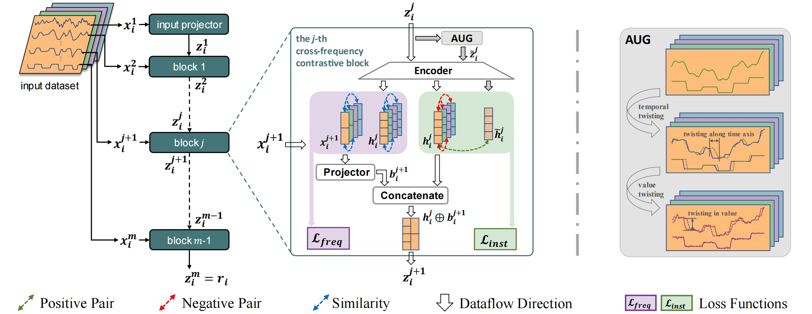

# MF-CLR

This repository contains the official implementation for the paper MF-CLR: Multi-Frequency Contrastive Learning Representation for Time Series





## Requirements

The recommended requirements for MF-CLR are specified as follows:
* Python 3.8
* torch==1.10.1
* scipy==1.6.1
* numpy==1.23.5
* pandas==1.5.3
* scikit_learn==1.2.2
* scipy==1.10.1
* statsmodels==0.14.0
* joblib==1.3.2
* pandarallel==1.6.3

The dependencies can be installed by:
```bash
pip install -r requirements.txt
```

## Prepare Data

You can get the public datasets:

* [30 UEA datasets](http://www.timeseriesclassification.com) should be put into `/data/UEA/`, so that each data file can be located by `/data/UEA/<dataset_name>/<dataset_name>_*.arff` .
* [SMAP, MSL, SMD](https://github.com/NetManAIOps/OmniAnomaly/tree/master), SMD should be put into `/data/SMD`, SMAP and MSL should be put into `/data/SMAP_MSL`
* [SWaT](https://drive.google.com/drive/folders/13Cg1KYOlzM5C7K8gK8NfC-F3EYxkM3D2?usp=sharing), download SWaT.zip and place into `/data/SWaT/*`
* [google drive(ETT, Traffic, Weather)](https://drive.google.com/drive/folders/13Cg1KYOlzM5C7K8gK8NfC-F3EYxkM3D2?usp=sharing), step 1：unzip all_datasets.zip， step2: move `/<dataset_name>` to `/data/<dataset_name>/`, so that each file can be loacated in `/data/<dataset_name>/*.csv`.

## Preprocessing

Preprocess data for Anomaly Detection task:

```python dataset_preprocessing_AD.py <dataset_name>```

where `<dataset_name>` in one of `SMAP`,`MSL` or `SMD`.


Preprocess data for end-to-end supervised method in Forecasting task:

```python preprocessing_supervised_fcst.py <dataset_name> <ot_granu>```

where `<dataset_name>` in one of `ETTm1`,`ETTm2`, `weather` or `traffic`. For ETTm1 and ETTm2, `<ot_granu>` in one of `quarterly`, `hourly`, `daily`.For traffic, `<ot_granu>` in one of `hourly`, `daily`. For weather,`<ot_granu>` in one of `10-minute`, `hourly`, `daily`, `weekly`. The preprocessed data is stored at `/data/PUBLIC_DATASETS/`.


## Usage

To train and evaluate MF_CLR on a dataset, run the following command:

```train & evaluate
sh scripts/<task_name>/MF-CLR.sh
```
where `<task_name>` is one of `classification`, `imputation`, `forecast`, and `anomaly_detection`.

The detailed descriptions about the arguments are as following:
| Parameter name | Description of parameter |
| --- | --- |
| task_name | task_name, option:[forecast, classification, imputation, anomaly_detection] |
| dataset | The dataset name, This can be set to ETTm1, ETTm2, traffic, weather for forecast and imputation, MSL,SMD,SMAP,Swat for anomaly-detection, filename in UEA dir for classification  |
| method | model_name, options:[MF-CLR, T-Loss, TS-TCC, TNC, TS2Vec, CPC, CoST] |
| batch_size | The batch size (defaults to 32) |
| enc_len | input sequence length |

(For descriptions of more arguments, see `EXP_FCST_PUBLIC_DATASETS.py`.)


## Baseline

In this paper, we reproduce the results of the following models by [Times-Series-Library](https://github.com/ZhengWr/Time-Series-Library?tab=readme-ov-file) 
- **DLinear** - Are Transformers Effective for Time Series Forecasting? [[AAAI 2023]](https://arxiv.org/pdf/2205.13504.pdf) [[Code]](https://github.com/thuml/Time-Series-Library/blob/main/models/DLinear.py)
- **PatchTST** - A Time Series is Worth 64 Words: Long-term Forecasting with Transformers [[ICLR 2023]](https://openreview.net/pdf?id=Jbdc0vTOcol) [[Code]](https://github.com/thuml/Time-Series-Library/blob/main/models/PatchTST.py).
- **TimesNet** - TimesNet: Temporal 2D-Variation Modeling for General Time Series Analysis [[ICLR 2023]](https://openreview.net/pdf?id=ju_Uqw384Oq) [[Code]](https://github.com/thuml/Time-Series-Library/blob/main/models/TimesNet.py)
- **Autoformer** - Autoformer: Decomposition Transformers with Auto-Correlation for Long-Term Series Forecasting [[NeurIPS 2021]](https://openreview.net/pdf?id=I55UqU-M11y) [[Code]](https://github.com/thuml/Time-Series-Library/blob/main/models/Autoformer.py).
- **Informer** - Informer: Beyond Efficient Transformer for Long Sequence Time-Series Forecasting [[AAAI 2021]](https://ojs.aaai.org/index.php/AAAI/article/view/17325/17132) [[Code]](https://github.com/thuml/Time-Series-Library/blob/main/models/Informer.py).
- **FEDformer** - FEDformer: Frequency Enhanced Decomposed Transformer for Long-term Series Forecasting [[ICML 2022]](https://proceedings.mlr.press/v162/zhou22g.html) [[Code]](https://github.com/thuml/Time-Series-Library/blob/main/models/FEDformer.py).

In addition, the codes of following models have already been included in this repo. You can use `sh scripts/<task_name>/<model_name>.sh` to reproduce the results. Note that enc_len refers to encoding length and this parameter can be adjusted for different tasks.

- **CoST** - COST: CONTRASTIVE LEARNING OF DISENTANGLED SEASONAL-TREND REPRESENTATIONS FOR TIME SERIES FORECASTING[[ICLR 2022]](https://openreview.net/pdf?id=PilZY3omXV2)[[code]](https://github.com/salesforce/CoST)
- **CPC** - Representation Learning with Contrastive Predictive Coding[[arXiv 2022]](https://arxiv.org/pdf/1807.03748.pdf)[[code]](https://github.com/Spijkervet/contrastive-predictive-coding)
- **TS-TCC** - Time-Series Representation Learning via Temporal and Contextual Contrasting[[IJCAI 2021]](https://www.ijcai.org/proceedings/2021/0324.pdf)[[code]](https://github.com/emadeldeen24/TS-TCC)
- **TNC** - UNSUPERVISED REPRESENTATION LEARNING FOR TIME SERIES WITH TEMPORAL NEIGHBORHOOD CODING[[ICLR 2021]](https://openreview.net/pdf?id=8qDwejCuCN)[[code]](https://github.com/ziyuanzhao2000/TNC_TS_baseline)
- **TLoss** - Unsupervised Scalable Representation Learning for Multivariate Time Series[[NeurIPS]](https://papers.nips.cc/paper_files/paper/2019/file/53c6de78244e9f528eb3e1cda69699bb-Paper.pdf)[[code]](https://github.com/White-Link/UnsupervisedScalableRepresentationLearningTimeSeries)
- **TFC** - Self-Supervised Contrastive Pre-Training for Time Series via Time-Frequency Consistency[[code]](https://github.com/mims-harvard/TFC-pretraining)[[NeurIPS 2022]](https://openreview.net/forum?id=OJ4mMfGKLN)
- **TS2Vec** - TS2Vec: Towards Universal Representation of Time Series[[AAAI 2022]](https://arxiv.org/abs/2106.10466)[[code]](https://github.com/yuezhihan/ts2vec)


We also include the following models in our repo, go into the directory `/algos/<model_name>` and `sh <model_name>.sh` to reproduce the results.
- **DeepAR** - COST: CONTRASTIVE LEARNING OF DISENTANGLED SEASONAL-TREND REPRESENTATIONS FOR TIME SERIES FORECASTING[[arXiv 2019]](https://arxiv.org/abs/1704.04110)[[code]](https://github.com/husnejahan/DeepAR-pytorch)
- **TCN** - Representation Learning with Contrastive Predictive Coding[[arXiv 2019]](https://arxiv.org/abs/1803.01271)[[code]](https://github.com/rajatsen91/deepglo/blob/master/DeepGLO/LocalModel.py)